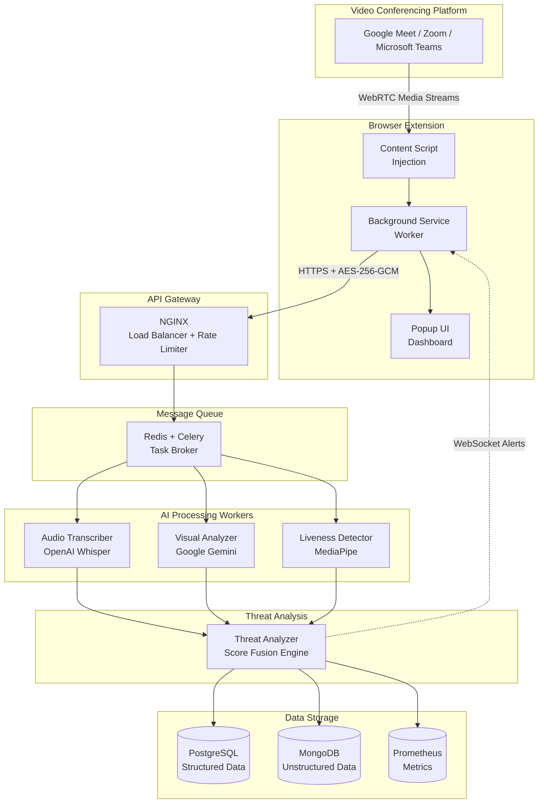

<div align="center">

# Kavalan

### Real-Time Digital Arrest Scam Detection During Video Calls

AI-powered browser extension protecting users from Digital Arrest scams through multimodal threat analysis

[](https://github.com/Keerthivasan-Venkitajalam/Kavalan)
[](LICENSE)
[](https://python.org)
[](https://www.typescriptlang.org/)
[](https://fastapi.tiangolo.com)
[](https://docker.com)

[About](#about-the-project) | [Architecture](#system-architecture) | [Features](#key-features) | [Getting Started](#getting-started) | [Tech Stack](#tech-stack) | [Team](#team)

</div>

---

## About the Project

Kavalan was developed by Team Thudakkam and recognized with 2nd Prize at GenAI Hackathon ML.Cbe 2025, organized by AI Tamil Nadu in collaboration with Nunnari Labs, DeepWeaver.ai, and Google for Developers.
Hackathon Demo URL - https://shorturl.at/063PD

---

## About the Project

Kavalan (meaning "Guardian" in Tamil) is a production-ready browser extension that provides real-time protection against Digital Arrest scams during video conferencing sessions. Using advanced multimodal AI analysis, Kavalan monitors audio, visual, and behavioral cues to detect scam patterns and alert users before they become victims.

### The Problem: Digital Arrest Scams

Digital Arrest scams have become a major threat in India, with fraudsters impersonating law enforcement officials during video calls to extort money from victims. These scams exploit:
- Authority intimidation: Fake police/CBI uniforms and badges
- Psychological pressure: Threats of arrest and legal action
- Urgency tactics: Demands for immediate payment
- Deepfake technology: AI-generated videos of officials

Traditional security solutions fail because these scams happen in real-time during legitimate video conferencing platforms (Google Meet, Zoom, Microsoft Teams).

### Our Solution

Kavalan transforms passive video calls into actively monitored sessions with:

- Real-time threat detection (sub-second latency)
- Multimodal AI analysis (audio + visual + liveness detection)
- Automatic evidence collection (Digital FIR generation)
- Multi-language support (Hindi, English, Tamil, Telugu, Malayalam, Kannada)
- DPDP Act 2023 compliance (data protection and privacy)
- Stress-aware UI optimized for elderly users under duress

---

## System Architecture

Kavalan follows a distributed microservices architecture with browser extension frontend and scalable backend services.



### Component Flow

1. **Media Capture**: Content script intercepts WebRTC streams from video platform
2. **Encryption**: Background service worker encrypts audio/video chunks with AES-256-GCM
3. **Transmission**: Encrypted data sent to API Gateway via HTTPS
4. **Task Distribution**: API Gateway enqueues tasks to Redis/Celery
5. **Parallel Processing**: Audio, Visual, Liveness workers process independently
6. **Score Fusion**: Threat Analyzer combines modality scores
7. **Alert Delivery**: Results pushed back to extension via WebSocket
8. **Evidence Storage**: Threat events logged to PostgreSQL + MongoDB

---

## Key Features

### Real-Time Protection

- Sub-second latency: End-to-end threat detection in under 1000ms
- Automatic activation: Monitoring starts when video call begins
- Non-intrusive: Runs silently in background without disrupting calls
- Platform support: Google Meet, Zoom, Microsoft Teams

### Multimodal AI Analysis

Audio Analysis (OpenAI Whisper)
- Speech-to-text transcription with word-level timestamps
- Keyword matching for scam patterns (authority, coercion, financial threats)
- Speaker diarization for multi-participant calls
- Low-confidence flagging for uncertain transcriptions

Visual Analysis (Google Gemini Vision)
- Uniform and badge detection (police, CBI, government)
- Threatening visual element identification
- On-screen text extraction (OCR)
- Confidence scoring for each detection

Liveness Detection (MediaPipe)
- Facial landmark analysis (468 points)
- Blink rate monitoring for deepfake detection
- Head pose variance analysis
- Stress indicator identification

### Threat Fusion Engine

- Weighted score combination: Audio (45%), Visual (35%), Liveness (20%)
- Confidence-weighted conflict resolution: Handles disagreements between modalities
- Unified threat score: 0-10 scale with threat levels (low/moderate/high/critical)
- Explainable AI: Human-readable explanations for each threat assessment

### Digital FIR Generation

- Automatic evidence collection: Triggered when threat score reaches 7.0 or higher
- Comprehensive package: Timestamped transcripts, video frames, threat scores
- Chain-of-custody tracking: Tamper-proof audit trail
- Legal compliance: PDF export for law enforcement submission
- Cryptographic signatures: Ensures evidence integrity

### Multi-Language Support

- 6 Indian languages: Hindi, English, Tamil, Telugu, Malayalam, Kannada
- Code-switching handling: Mixed-language transcription
- Localized alerts: Warnings displayed in user's preferred language
- Language-specific patterns: Threat detection adapted per language

### Security & Compliance

- End-to-end encryption: AES-256-GCM for all media transmission
- DPDP Act 2023 compliance: Data protection and privacy regulations
- Data residency: All data stored within Indian territory
- Audit logging: Complete trail of all data access operations
- User consent: Explicit opt-in required before processing

### Accessibility

- Stress-aware UI: Optimized for elderly users under duress
- Large fonts: Minimum 16px with high contrast colors
- Screen reader support: ARIA labels for visually impaired users
- Keyboard navigation: Full functionality without mouse
- Simple actions: Emergency "End Call" button prominently displayed

---

## Tech Stack

### Frontend (Browser Extension)

- Framework: Chrome/Firefox Extension (Manifest V3)
- Language: TypeScript 5.0
- UI Library: React 18 with Vite 4
- Styling: Tailwind CSS 3.4
- State Management: React Hooks
- Encryption: Web Crypto API (AES-256-GCM)

### Backend Services

- API Framework: FastAPI (Python 3.12)
- Message Queue: Redis + Celery
- Load Balancer: NGINX with TLS termination
- Authentication: JWT tokens
- Rate Limiting: Per-user and per-IP throttling

### AI/ML Models

- Audio Transcription: OpenAI Whisper (medium model)
- Visual Analysis: Google Gemini 2.5 Flash Vision API
- Liveness Detection: MediaPipe Face Landmarker
- Embeddings: IndicSBERT for Dravidian languages

### Databases

- Structured Data: PostgreSQL 18 (users, sessions, threat events, audit logs)
- Unstructured Data: MongoDB (transcripts, video frames, evidence packages)
- Vector Search: pgvector for semantic similarity
- Caching: Redis for threat patterns and intermediate results

### Infrastructure

- Containerization: Docker + Docker Compose
- Orchestration: Kubernetes with auto-scaling
- Observability: Prometheus + Grafana + OpenTelemetry
- CI/CD: GitHub Actions with blue-green deployment
- Cloud: AWS Mumbai, GCP Chennai (Indian data centers)

---

## Getting Started

### Prerequisites

- Docker & Docker Compose (for simplest setup)
- Node.js 18+ (for frontend development)
- Python 3.12+ (for backend development)
- API Keys:
  - Google Gemini API key from [Google AI Studio](https://makersuite.google.com/app/apikey)
  - OpenAI API key (optional, for Whisper cloud API)

### Quick Start (Docker)

```bash
# 1. Clone the repository
git clone https://github.com/Keerthivasan-Venkitajalam/Kavalan.git
cd Kavalan

# 2. Configure environment
cp .env.example .env
# Add your API keys to .env:
# - GEMINI_API_KEY=your_key_here
# - OPENAI_API_KEY=your_key_here (optional)

# 3. Start backend services (PostgreSQL, MongoDB, Redis, API)
docker compose up -d --build

# 4. Initialize databases
docker exec kavalan-api python -m scripts.init_db

# 5. Start frontend (in separate terminal)
cd packages/extension
npm install
npm run dev

# 6. Load extension in browser
# Chrome: chrome://extensions/ → Load unpacked → select packages/extension/dist
# Firefox: about:debugging → Load Temporary Add-on → select packages/extension/dist/manifest.json

# 7. Open browser
# http://localhost:8000/docs (API documentation)
# http://localhost:8000/health (Health check)
```

### Verify Installation

```bash
# Check backend health
curl http://localhost:8000/health/dependencies | jq

# Expected response:
# {
#   "status": "healthy",
#   "checks": {
#     "database": { "status": "healthy" },
#     "redis": { "status": "healthy" },
#     "mongodb": { "status": "healthy" }
#   }
# }
```

### Development Setup

```bash
# Backend development
cd packages/backend
python -m venv venv
source venv/bin/activate  # On Windows: venv\Scripts\activate
pip install -r requirements.txt
pip install -r requirements-dev.txt

# Run tests
pytest tests/ -v

# Run with hot reload
uvicorn app.main:app --reload --host 0.0.0.0 --port 8000

# Frontend development
cd packages/extension
npm install
npm run dev  # Development build with watch mode
npm run build  # Production build
npm test  # Run tests
```

---

## Project Structure

```
Kavalan/
├── packages/
│   ├── extension/              # Browser extension (TypeScript)
│   │   ├── src/
│   │   │   ├── background/    # Service worker
│   │   │   ├── content/       # Content scripts
│   │   │   ├── popup/         # React UI
│   │   │   ├── utils/         # Encryption, storage, compression
│   │   │   └── i18n/          # Translations
│   │   ├── manifest.json      # Extension manifest
│   │   └── package.json
│   │
│   └── backend/               # Backend services (Python)
│       ├── app/
│       │   ├── routes/        # API endpoints
│       │   ├── services/      # AI inference engines
│       │   ├── tasks/         # Celery tasks
│       │   ├── db/            # Database access layers
│       │   ├── middleware/    # Auth, rate limiting, metrics
│       │   └── utils/         # Circuit breakers, caching, logging
│       ├── tests/             # Unit + property-based tests
│       ├── grafana/           # Monitoring dashboards
│       ├── prometheus/        # Metrics configuration
│       └── requirements.txt
│
├── .github/
│   ├── workflows/             # CI/CD pipelines
│   └── k8s/                   # Kubernetes manifests
│
├── .kiro/
│   ├── specs/                 # Specification documents
│   └── steering/              # Architecture guidelines
│
├── docker-compose.yml         # Local development setup
├── README.md                  # This file
└── LICENSE                    # MIT License
```

---

## Configuration

Kavalan is configured via environment variables in `.env`:

### Required Variables

| Variable | Description | Example |
|----------|-------------|---------|
| `GEMINI_API_KEY` | Google Gemini API key | `AIza...` |
| `DB_HOST` | PostgreSQL host | `localhost` |
| `DB_PORT` | PostgreSQL port | `5432` |
| `DB_NAME` | Database name | `kavalan` |
| `DB_USER` | Database user | `postgres` |
| `DB_PASSWORD` | Database password | `secure_password` |
| `MONGODB_URI` | MongoDB connection string | `mongodb://localhost:27017` |
| `REDIS_URL` | Redis connection URL | `redis://localhost:6379/0` |

### Optional Variables

| Variable | Description | Default |
|----------|-------------|---------|
| `OPENAI_API_KEY` | OpenAI API key (for Whisper cloud) | - |
| `LOG_LEVEL` | Logging level | `INFO` |
| `CELERY_WORKERS` | Number of Celery workers | `4` |
| `MAX_QUEUE_SIZE` | Maximum task queue size | `1000` |
| `ALERT_THRESHOLD` | Threat score threshold for alerts | `7.0` |

---

## Testing

### Backend Tests

```bash
cd packages/backend

# Run all tests
pytest tests/ -v

# Run specific test categories
pytest tests/test_audio_transcriber.py -v  # Audio tests
pytest tests/test_visual_analyzer.py -v    # Visual tests
pytest tests/test_liveness_detector.py -v  # Liveness tests
pytest tests/test_threat_analyzer.py -v    # Fusion tests

# Run property-based tests
pytest tests/ -k "property" -v

# Run with coverage
pytest tests/ --cov=app --cov-report=html
```

### Frontend Tests

```bash
cd packages/extension

# Run all tests
npm test

# Run specific test suites
npm test -- platform-detector.test.ts
npm test -- encryption.property.test.ts

# Run with coverage
npm test -- --coverage
```

### Integration Tests

```bash
# End-to-end threat detection flow
pytest packages/backend/tests/test_e2e_threat_detection.py -v

# Extension-backend communication
pytest packages/backend/tests/test_extension_backend_integration.py -v

# Parallel processing
pytest packages/backend/tests/test_parallel_processing.py -v
```

---

## Deployment

### Docker Production

```bash
# Build and deploy
docker compose -f docker-compose.prod.yml up -d --build

# View logs
docker logs -f kavalan-api
docker logs -f kavalan-celery-worker

# Scale workers
docker compose -f docker-compose.prod.yml up -d --scale celery-worker=8
```

### Kubernetes

```bash
# Apply configurations
kubectl apply -k .github/k8s/

# Check status
kubectl get pods -n kavalan
kubectl logs -n kavalan deployment/kavalan-api

# Port forward for local access
kubectl port-forward -n kavalan svc/kavalan-api 8000:8000
```

### CI/CD Pipeline

The project includes GitHub Actions workflows for:

- **Continuous Integration**: Lint, test, build on every push
- **Continuous Deployment**: Auto-deploy to staging, manual approval for production
- **Blue-Green Deployment**: Zero-downtime releases
- **Smoke Tests**: Post-deployment health checks
- **Automatic Rollback**: Revert on failure

---

## Observability

### Prometheus Metrics

Available at `/metrics`:

- `kavalan_queries_total`: Total queries processed
- `kavalan_query_duration_seconds`: Query latency histogram
- `kavalan_threat_score`: Threat score distribution
- `kavalan_alerts_triggered`: Alert count by severity
- `kavalan_llm_tokens_total`: Token usage for cost tracking

### Grafana Dashboards

Pre-built dashboards for:

- Threat Detection Overview: Real-time threat rates, alert distribution
- System Health: CPU, memory, queue depth, error rates
- Service Performance: Latency percentiles, throughput, success rates

### OpenTelemetry Tracing

Distributed tracing for end-to-end request flows:

- Extension to API Gateway to Message Queue to Workers to Database
- Span details for each processing stage
- Error tracking with stack traces

---

## Contributing

We welcome contributions from the community! Whether you're fixing bugs, adding features, improving documentation, or enhancing AI models, your help is appreciated.

### How to Contribute

1. Fork the repository
2. Create a feature branch (`git checkout -b feature/amazing-feature`)
3. Commit your changes (`git commit -m 'Add some amazing feature'`)
4. Add tests for new functionality
5. Run the test suite (`pytest` and `npm test`)
6. Push to the branch (`git push origin feature/amazing-feature`)
7. Open a Pull Request

### Development Guidelines

- Follow PEP 8 (Python) and ESLint (TypeScript) style guidelines
- Write type hints for all Python functions
- Add docstrings for public APIs
- Update documentation for user-facing changes
- Keep commits atomic and well-described
- Test both backend and frontend changes

---

## Team

<div align="center">

### Team Thudakkam

| Member | Role | GitHub |
|--------|------|--------|
| Keerthivasan S V | Lead Developer & AI/ML | [@Keerthivasan-Venkitajalam](https://github.com/Keerthivasan-Venkitajalam) |
| Naveen Babu M S | Backend & Infrastructure | [@naveen-astra](https://github.com/naveen-astra) |
| B Rahul | Frontend & Extension | [@Bat-hub-hash](https://github.com/Bat-hub-hash) |

</div>

---

## License

This project is licensed under the MIT License. See the [LICENSE](LICENSE) file for details.

---

## Acknowledgments

- AI Tamil Nadu (formerly AI Coimbatore) for organizing the hackathon
- Nunnari Labs, DeepWeaver.ai, and Google for Developers for their support
- OpenAI for Whisper speech recognition
- Google for Gemini Vision API
- MediaPipe team for facial landmark detection
- Open-source community for foundational libraries

---

## Contact

For questions, feedback, or collaboration opportunities:

- GitHub Issues: [Report Bug](https://github.com/Keerthivasan-Venkitajalam/Kavalan/issues) | [Request Feature](https://github.com/Keerthivasan-Venkitajalam/Kavalan/issues)

---

<div align="center">

Kavalan - Protecting India from Digital Arrest Scams

Built by Team Thudakkam

[Star us on GitHub](https://github.com/Keerthivasan-Venkitajalam/Kavalan) | [Read the Docs](https://github.com/Keerthivasan-Venkitajalam/Kavalan/wiki) | [Report Issues](https://github.com/Keerthivasan-Venkitajalam/Kavalan/issues)

</div>
